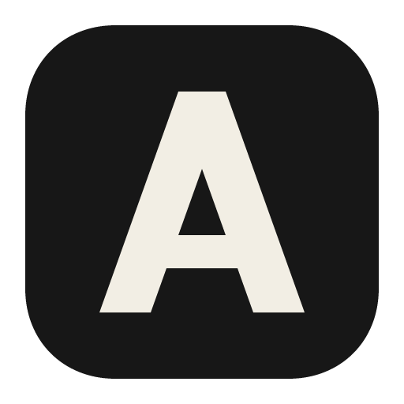

> [!IMPORTANT]
> Remove this line to confirm you've reviewed this PR before submitting.
<div align="center">
  
  <h1>Anna</h1>
  <p>The AI engineering workspace.</p>
  <p><a href="https://github.com/Workspaacing/anna/releases/latest"><strong>Download</strong></a></p>
</div>

---

Anna plans, codes, tests and ships — natively, on your machine.

Anna is a native code editor with an AI agent teammate inside it, also called Anna. The agent works in your project the way you do: it edits files through the editor's own buffers, runs your commands and tests, checks what it wrote, and takes the work to GitHub as issues and pull requests. You keep the editor, the diff, and the final say.

Anna is built on [Zed](https://github.com/zed-industries/zed). It uses Zed's editor core, GPU rendering, and language tooling, without collaboration, channels, accounts or telemetry.

## Features

- **Native and fast.** Written in Rust, rendered on the GPU. No Electron or webviews. Opens instantly and stays responsive on large views.
- **Lightweight.** Base memory usage is even lower than Zed.
- **An agent that works in your project.** Anna reads, writes and edits files through the editor's buffers, so its changes appear in open tabs, the undo history and the git gutter. It can run commands, fetch a web page, scan the repository for leaked secrets, look for outdated dependencies, and work with GitHub issues, pull requests, checks and security alerts.
- **Checks on everything it writes.** Anna refuses to write an API key or token into a file, runs your project's own formatter over its edits, hands the agent the diagnostics your language servers report, and checks edited manifests against the [OSV](https://osv.dev) advisory database. Each check can be turned off.
- **Your models, your keys.** Pick any model in the [models.dev](https://models.dev) catalog. There is no Anna account and no Anna proxy: requests go straight to the provider you picked, using a key from your environment or one you enter, which is kept in your operating system's credential store.
- **Feels like VS Code out of the box.** UI and defaults are tuned so you don't have to relearn your editor.
- **No account or telemetry.** Nothing to sign in to. Anna never sends your usage data anywhere.

## The agent

The agent is split the way the rest of the workspace is: a dock panel holds your session history,
search and provider status, while each conversation opens as an ordinary tab in the center, next to
the code it's about.

To use it:

1. Connect a provider: export its API key under the variable name [models.dev](https://models.dev)
   lists for it — for example `ANTHROPIC_API_KEY` or `OPENAI_API_KEY` — and start Anna from that
   environment, or enter the key in the agent's settings page.
2. Press <kbd>ctrl-alt-a</kbd> (<kbd>cmd-ctrl-a</kbd> on macOS) to open the panel, then
   <kbd>ctrl-alt-n</kbd> (<kbd>cmd-ctrl-t</kbd>) to start a thread.
3. Pick a model from the header of the thread. Threads are stored locally and are searchable from
   the panel.

The permission level you choose decides which commands the agent asks about before running them.
Set `"cowork": { "button": false }` in your settings to hide the agent from the activity bar; the
settings key keeps the agent's earlier name.

---


## Docs

See [docs](https://wu.farshed.me).

## Install

Download the installer for your platform [here](https://github.com/Workspaacing/anna/releases/latest). Then follow the steps below.

### macOS (Apple Silicon)

1. Download `Anna-aarch64.dmg`, open it, and drag Anna into your Applications folder. Anna is not signed with an Apple Developer certificate yet, so macOS will block it the first time you open it.
2. Open Terminal and run:

   ```sh
   xattr -d com.apple.quarantine /Applications/Anna.app
   ```

3. Open Anna normally.

If you'd rather not use Terminal: open Anna once (you'll see an "Anna can't be opened" or "Apple could not verify" message), then go to **System Settings → Privacy & Security**, scroll down, and click **Open Anyway** next to Anna. Confirm with your password.

### Linux (x86_64 and aarch64)

Download `anna-linux-<arch>.tar.gz` and unpack it into `~/.local`:

```sh
tar -xzf anna-linux-$(uname -m).tar.gz -C ~/.local
ln -sf ~/.local/anna.app/bin/anna ~/.local/bin/anna
```

Make sure `~/.local/bin` is on your `PATH`, then run `anna`.

### Windows (x86_64)

Download and run `Anna-x86_64.exe`.

Anna's installer isn't code-signed yet, so the first time you run it Windows SmartScreen shows **"Windows protected your PC"** with an unknown publisher. Windows shows this for any download that isn't signed; it doesn't mean anything was detected in the file. Click **Run anyway**. On some versions of Windows, click **More info** first.

### Verifying a download

Every release file is built from this repository by the public [release workflow](https://github.com/Workspaacing/anna/actions/workflows/release.yml), and the [release page](https://github.com/Workspaacing/anna/releases/latest) lists each file's SHA-256 digest. Compare it with the digest of your download: `Get-FileHash .\Anna-x86_64.exe` on Windows, `shasum -a 256 <file>` on macOS, or `sha256sum <file>` on Linux.

## Building

Anna builds the same way Zed does. See the [Zed development docs](https://zed.dev/docs/development).

## Licensing

Anna is licensed under GPL-3.0-or-later with Apache-2.0 components where marked. See [LICENSE-GPL](./LICENSE-GPL) and [LICENSE-APACHE](./LICENSE-APACHE).

Anna is a derivative work of [Zed](https://github.com/zed-industries/zed) and shares the same licenses.

## Acknowledgements

Thanks to the Zed team for building an excellent editor and releasing it as open source. Anna would not exist without their work.
